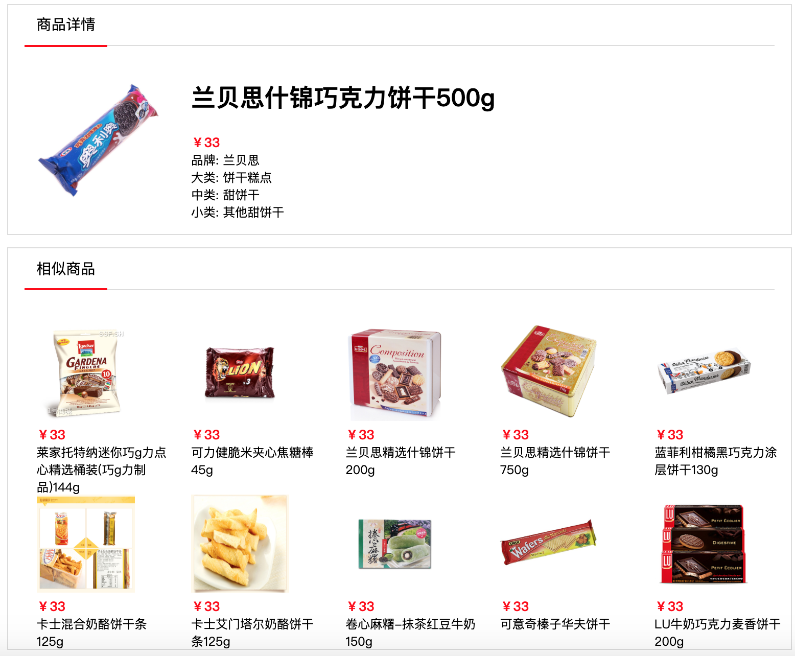

# recsys_faiss
一个基于 fasttext + faiss + flask的商品内容相关推荐接口实现，使用nginx+uwsgi+flask封装faiss检索接口，用于在线embedding召回和商品详情页相关推荐

#### 商品详情页效果图
将模型部署应用


#### 模型接口流程图


#### 训练商品属性的特征向量，商品向量add到faiss
```
python embedding_recsys.py
```

#### flask封装faiss接口，输入商品id重建向量，进行余弦相似度检索
#### 启动uwsgi
```
uwsgi uwsgi.ini
```

#### nginx配置
```
server {
    listen 8089; # 指定监听的端口
    charset utf-8;

    server_name localhost; # ip地址
    location / {
        include      uwsgi_params;
        uwsgi_pass   127.0.0.1:8088;
        uwsgi_param UWSGI_CHDIR /Users/PycharmProjects/recsys_faiss;
        uwsgi_param UWSGI_SCRIPT recsys_faiss.faiss_api.py;
        }
    }
```

#### 启动nginx
```
nginx
```

#### 接口测试
get请求
```
python
>>> import requests
>>> res = requests.get("http://127.0.0.1:8089/faiss/similar_items/?spu=3&n_items=50")
>>> res.json()
{'code': '200', 'msg': '处理成功', 'result': {'56482': 1.0, '92237': 1.0, '56483': 1.0, '56481': 1.0, '56484': 1.0, '56485': 1.0, '56486': 1.0, '4': 1.0, '18': 0.9981815814971924, '19': 0.9981815814971924, '20': 0.9981815814971924, '6': 0.9978658556938171, '8': 0.9978658556938171, '9': 0.9978658556938171, '7': 0.9978658556938171, '10': 0.9978658556938171, '12813': 0.9968835115432739, '115056': 0.9962125420570374, '115053': 0.9962125420570374, '115057': 0.9962125420570374, '115054': 0.9962125420570374, '115055': 0.9962125420570374, '8247': 0.995913028717041, '8248': 0.995913028717041, '8250': 0.995913028717041, '8258': 0.995913028717041, '8259': 0.995913028717041, '8245': 0.995913028717041, '8249': 0.995913028717041, '8260': 0.995913028717041, '8244': 0.995913028717041, '1579': 0.99582839012146, '1576': 0.99582839012146, '1582': 0.99582839012146, '1573': 0.99582839012146, '1577': 0.99582839012146, '1583': 0.99582839012146, '1575': 0.99582839012146, '111679': 0.9957014322280884, '111680': 0.9957014322280884, '111678': 0.9957014322280884, '8220': 0.9956346750259399, '8228': 0.9956346750259399, '8222': 0.9956346750259399, '8216': 0.9956346750259399, '8219': 0.9956346750259399, '8221': 0.9956346750259399, '8229': 0.9956346750259399, '110307': 0.9955586791038513}}
```

#### 推荐结果验证
spu = 3
```
+-------------+--------------------------------------+
| ITEM_NUM_ID | ITEM_NAME                            |
+-------------+--------------------------------------+
|           3 | 卓德优格乳杏口味含乳饮品             |
+-------------+--------------------------------------+
```

#### 推荐结果
```
+-------------+---------------------------------------------------------------------------+
| ITEM_NUM_ID | ITEM_NAME                                                                 |
+-------------+---------------------------------------------------------------------------+
|          19 | 卓德低脂热处理风味发酵乳（森林水果口味）120g                              |
|        8221 | 爱乐薇蓝莓味含乳饮品125克                                                 |
|       56481 | 卓德风味发酵乳（草莓鲜酪口味）120g                                        |
|           8 | 卓德脱脂含乳饮品（覆盆子口味）                                            |
|       56483 | 卓德风味发酵乳（香草口味）120g                                            |
|          20 | 卓德低脂热处理风味发酵乳（草莓口味）120g                                  |
|       56484 | 卓德脱脂含乳饮品水蜜桃口味+覆盆子口味4*115g                               |
|       56486 | 卓德热处理风味发酵乳（原味）4*115g                                        |
|       56482 | 卓德风味发酵乳（焗苹果口味）120g                                          |
|        8229 | 爱乐薇菠萝味含乳饮品125克                                                 |
|          18 | 卓德低脂热处理风味发酵乳（水蜜桃、西番莲口味）120g                        |
|           4 | 卓德优格乳草莓口味含乳饮品                                                |
|       92237 | 卓德含乳饮品（草莓口味）460克（4*115克）                                  |
|           6 | 卓德脱脂含乳饮品（水蜜桃口味）                                            |
+-------------+---------------------------------------------------------------------------+
```

#### 接口压力测试
```
siege -c 100 -t 10s -b "http://127.0.0.1:8089/faiss/similar_items/?spu=3&n_items=50"

Transactions:		       41011 hits
Availability:		      100.00 %
Elapsed time:		        9.17 secs
Data transferred:	       12.24 MB
Response time:		        0.02 secs
Transaction rate:	     4472.30 trans/sec
Throughput:		        1.33 MB/sec
Concurrency:		       99.57
Successful transactions:       41011
Failed transactions:	           0
Longest transaction:	        0.07
Shortest transaction:	        0.00
```
